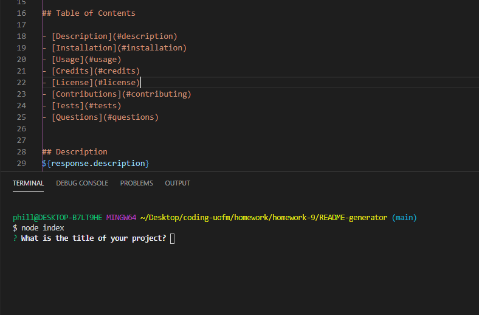

# README generator
Did you ever want to make a readme for your project, but just didnt know where to begin? Well now you dont need to! Using our app, all you need to do is answer a series of questions, and your very own readme will be generated for you!
 
## Screenshots

## How to use?
Open the command line, and type, 'node index.js', hit 'enter', and you will be given a series of prompts to answer. Once you have finished answering all the prompts, a new readme file will be generated! You can view an instructional video [here](https://drive.google.com/file/d/1B6mKdXCyHvtRd2exauJ2VAjfmCAa3wDU/view) 
and the Github repo [here!](https://github.com/phillipmerriman/README-generator)

© 2020 [Phillip Merriman](https://github.com/phillipmerriman)